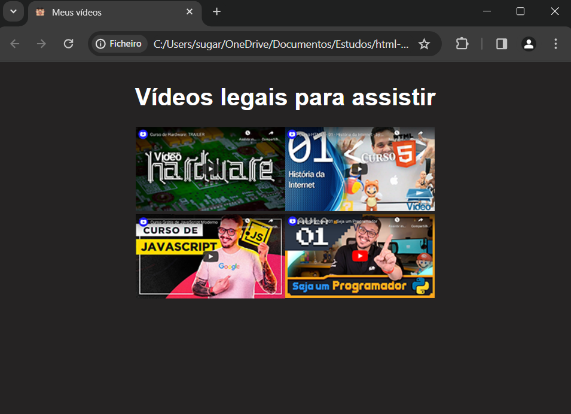

</head>
<body>
    
    <h2 style="color: lightblue;">&#x1F517;Link</h2>
    
<a href="https://wyllamrenato.github.io/Desafio-Videos1/" rel="external" target="_blank">https://wyllamrenato.github.io/Desafio-Videos/</a>

    <ul>
        <li>Clique no link acima para ter acesso a página.</li>
    </ul>
    <h1 style="font-family: Arial, Helvetica, sans-serif; color: lightblue;">Desafio 009 - Site de Recomendação de Vídeos &#x25B6;&#xFE0F;</h1>
    
Este repositório contém a solução para o Desafio 009 do Curso de HTML5-CSS3 do canal Curso em Vídeo no YouTube. O desafio consiste em criar um site interativo onde o usuário pode indicar quatro vídeos interessantes, cada um com sua própria página dedicada.

    <h2 style="font-family:  Arial, Helvetica, sans-serif; color: lightblue;">Funcionalidades Implementadas</h2>
    <ul style="font-family:  Arial, Helvetica, sans-serif;">
      <li><strong>Listagem de Vídeos: </strong>Quatro vídeos são apresentados na página principal, cada um com sua miniatura.</li>
      <li><strong>Páginas Individuas: </strong>Ao clicar em uma miniatura, o usuário é redirecionado para uma página específica para o vídeo selecionado.</li>
      <li><strong>Player do Youtube: </strong>Os vídeos são incorporados usando o player do YouTube, proporcionando uma experiência de visualização integrada.</li>
      <li><strong>Links Adicionais: </strong>Cada página de vídeo possui dois links:</li>
      <ul>
        <li><strong>Veja o Curso Completo: </strong>Redireciona o visitante para a playlist oficial do YouTube em uma nova aba.</li>
        <li><strong>Botão de Voltar: </strong>Uma imagem que funciona como um botão de volta, levando o usuário de volta à página anterior.</li>
      </ul>
    </ul>
    <h2 style="font-family:  Arial, Helvetica, sans-serif; color: lightblue;">Tecnologias Utilizadas</h2>
     <ul>
       <li>HTML5</li>
       <li>CSS3</li>
     </ul>
    <h2 style="font-family:  Arial, Helvetica, sans-serif; color: lightblue;">Agradecimentos</h2>
    
Agradeço ao Curso em Vídeo por fornecer conteúdo educacional de qualidade e desafios práticos que contribuem para o aprendizado contínuo de HTML5 e CSS3.

Espero que este projeto seja útil e inspirador para outros aprendizes. Divirta-se explorando os vídeos recomendados!

</body>
</html>
